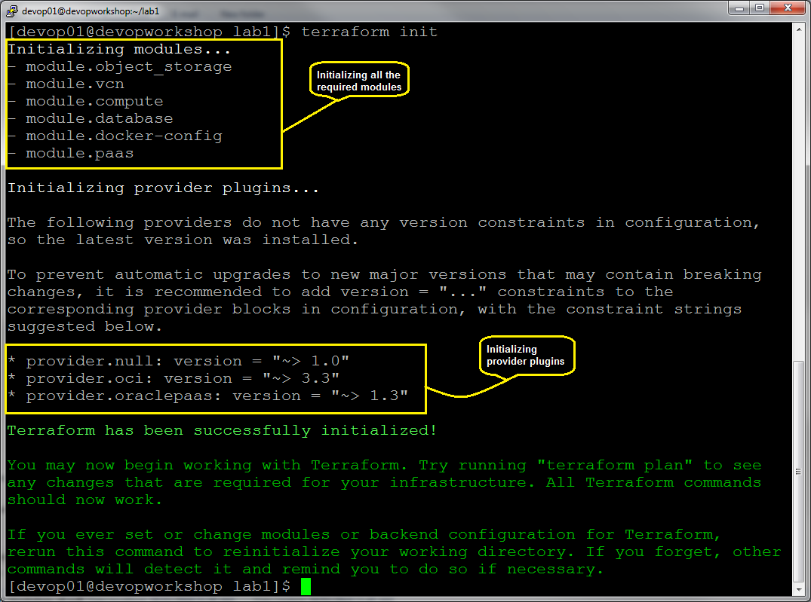

  
Updated: Date

## Introduction

Introductory Text

**_To log issues_**, click here to go to the [github oracle](https://github.com/oracle/learning-library/issues/new) repository issue submission form.

## Objectives

- Objective 1
- Objective 2

## Required Artifacts

- List of Prerequisites

# Main Heading 1

## Sub Heading 1

### **STEP 1**: Title of Step 1

- Instructions for Step 1

### **STEP 2**: Title of Step 2

- To Review the terraform plan to see all the resources terraform will provision in this lab, first initialize the terraform providers and modules needed and then generate the terraform plan and review the resources that terraform will create. In this lab, terraform will create a total of 21 resources. Type the below commands to verify the plan.

  `terraform init`
  
  `terraform plan -out plan.out`
  
  
  
  
