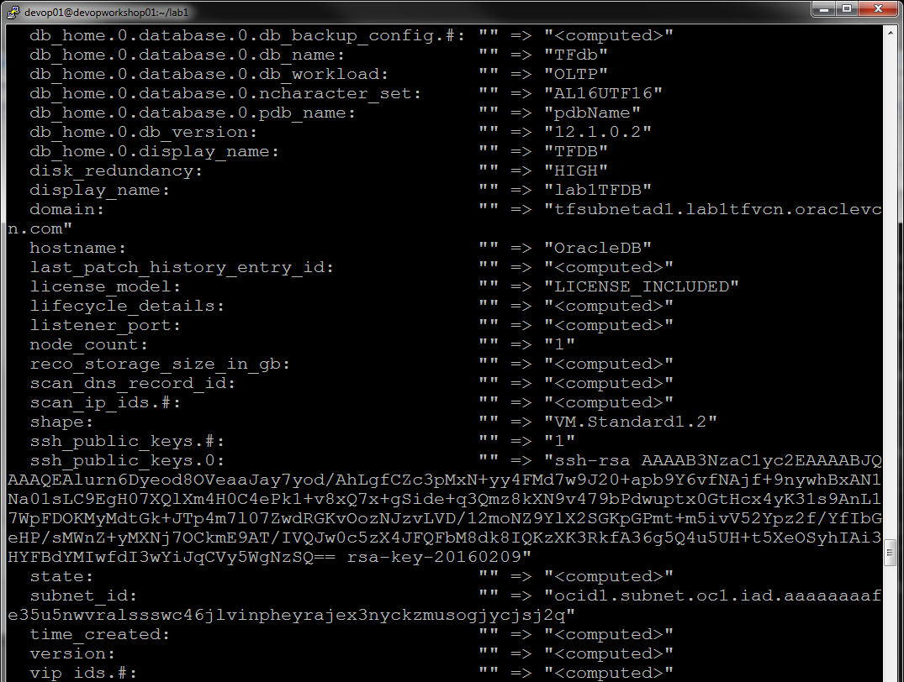
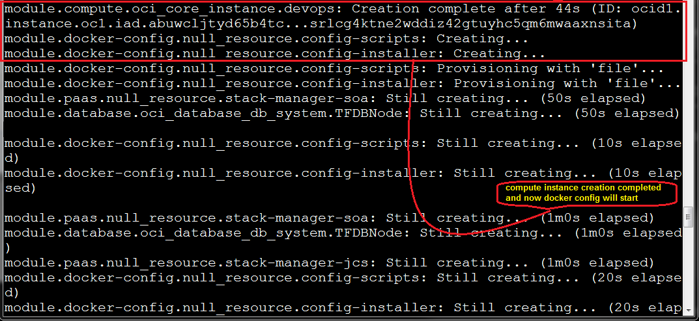

  

## Introduction

In this Lab, you will start provisioning a multi-tier environment. This workshop uses a typical end-to-end application architecture in the HHS space and walks through the automation steps to provision the neccessary cloud services on the Oracle public cloud.  It will also cover end-to-end application configuration and deployment to move the on-premise application to the public cloud.  


**_To log issues_**, click here to go to the [github oracle](https://github.com/oracle/learning-library/issues/new) repository issue submission form.

## Objectives

- In this lab, you will provision an environment consists of the following 3 stacks using Terraform:
  
* A custom stack for Liberty Insurance App running Docker Container on a compute instance and OCI Database System
* A SOACS stack for service bus project with proxy and business services running on SOACS and DBCS.
* A JCS stack for HHS application running on JCS and DBCS


## Required Artifacts

*	Putty or ssh client to login to workshop vm
*	Web Browser to access cloud console

## Instructor will provide the following

*	Public IP of workshop vm along with username and ssh key to access the workshop VM
*	Access info for OCI Cloud Account


# Environment Provisioning

## Using Terraform to provision the required environment

### **STEP 1**: Putty or SSH into workshop VM

### Putty Instructions

* Start a new putty session to the workshop vm as shown below.

* Enter the public ip of the workshop vm 


* In Connection -> SSH -> Auth, browse and select the ppk format private key


* In Connection, check **Enable TCP keepalives** and set **Seconds between keepalives** to **5**


* Click **Open**

* When prompted for login as, enter username **devopXX** provided by instructor 


* Enter the following commands as shown to create and edit a file which you will use to store all the neccessary environment variables: 

```
cd lab1
cp env-var env-var.gse
vi env-var.gse
```


* You will now go to next step to find your cloud account information needed to fill in the values for the environment variables inside the yellow rectangle sections and set this environment file


### Alternate Intructions to use SSH

* enter the following command inserting your own **private_key_file**, **username**, and **public_ip**
```
ssh -i <private_key_file> <username>@<public_ip>
```
* You will now go to next step to find your cloud account information needed to fill in the values for the environment variables inside the yellow rectangle sections and set this environment file

### **STEP 2**: Login into Cloud Service Dashboard

- Login into Cloud Service Dashboard using the Cloud Service Dashboard URL with the cloud account access information provided by the instructor to note down information required to run Terraform.

- Open a web browser and go to the cloud service dashboard url and login with username and password provided. Enter this password in TF_VAR_password in env-var.gse.


- Click on the Compute link to view the service detail of OCI.  


- Note down the Identity Service Id and Subscription ID.  Enter the Identity Service Id  in TF_VAR_domain and Subscription ID in TF_VAR_subscription_id. 


- Click Open Service Console to Open OCI Console.


- Click on the MENU and navigate to Governance -> Service Limits and copy the tenancy OCID and note down the Home Region.  Enter the tenancy OCID in TF_VAR_tenancy_ocid,  the tenancy in TF_VAR_tenancy and the Home Region in TF_VAR_region.


  
- Click on the MENU and navigate to Identity -> Users  


- Copy the OCID of user gse-admin_ww@oracle.com and enter the user ocid in TF_VAR_user_ocid.


- Click on Compartments and copy OCID of Demo compartment and ManagedCompartmentForPaaS and enter demo OCID in TF_VAR_compartment_ocid  and ManagedCompartmentForPaaS  OCID in TF_VAR_paas_compartment_ocid. 


- Enter the swift password provided by instructor in TF_VAR_swift_password. 

- Save the env-var.gse by pressing **Shift-Z-Z**.  Here’s an example of env-var.gse with the environment variable values filled in: 


- Source the environment. 
```
$ . ./env-var.gse
 ```


- Terraform can generate an execution plan that shows all the resources that Terraform will create, change or destroy when it runs without actually applying any of the changes.  This step let you review the execution plan to see all the resources terraform will provision in this lab. First run `terraform init` to initialize the terraform providers and modules needed and then run `terraform plan` to generate the execution plan and review the resources that terraform will created.  In this lab, terraform will create a total of 21 resources.

```
$ terraform init
$ terraform plan -out plan.out
```


  
  
  
  
  
  
  
  
  
  
  
  
  
  
  
  
  
  
  
  
  
  
  
  
  
  
  
### **STEP 3**: Provisioning Resources

- Now to provision the environment and all the resources, run the following command as shown in the screenshots.

  ```
  terraform apply "plan.out"
  ```
  
  
  
  
  
  
  
  
  
  
  
  
  
  
  
  
  
  
  
  
  
  
  
  
  
  
  
  
  
  
  
  
  
  
  
- Terraform is now running.  **YOU HAVE SUCCESSFULLY COMPLETED LAB1**.  This may take several hours to complete.  DO NOT WAIT FOR this to complete.  We will continue to Lab2. 

- You can login to OCI Console to see that VCN and all the network resource and a compute instance has already been created.  Other resources such as OCI DB System, JCS and SOACS are still being provisioned.  When terraform completes, you will see the following.  Please do not wait for this to complete.

  

  
  
You can also open another putty or ssh window to the workshop vm and review the terraform templates in both the lab1 and modules directory in detail.
  
  
  
  
