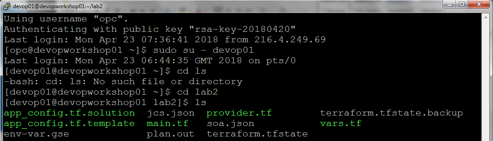
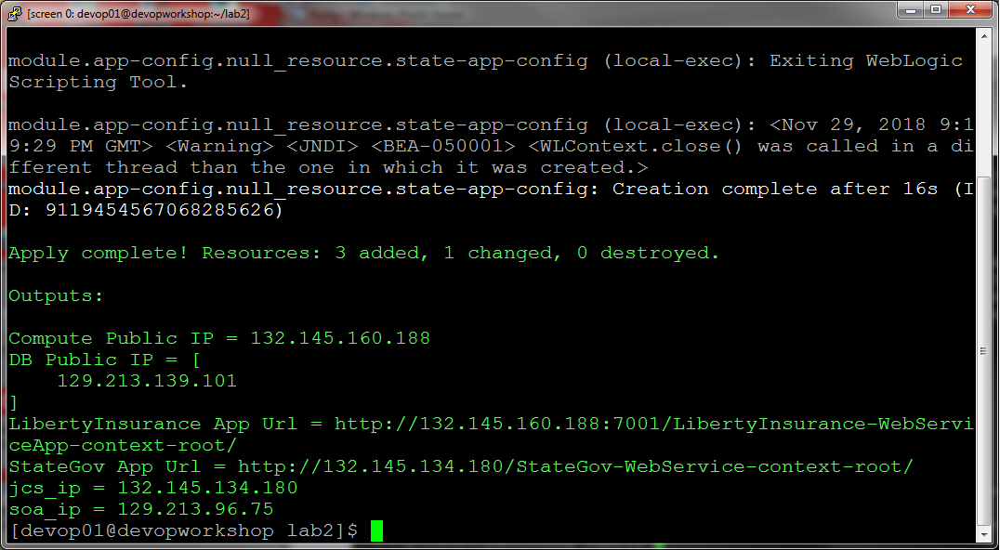

  
Updated: 04/24/2018

## Introduction

In this Lab, you are provided with an already provisioned environment as shown in Lab 101.

  

Leveraging this environment, you will configure applications to run in each of the 3 stacks.  

  
  
**_To log issues_**, click here to go to the [github oracle](https://github.com/oracle/learning-library/issues/new) repository issue submission form.

## Objectives

- The terraform module in this lab will configure the following:
  
  * In the Liberty Insurance stack, a WebLogic JDBCS Connection Pool and Data Source is configured on the WebLogic server and the Liberty Insurance application is then deployed on the WebLogic server using the JDBC Data Source to retrieve and insert applicant information from the OCI database
  
  * In the SOACS stack, service bus project configuration is then imported into service bus.
  
  * In the JCS stack, the HHS application is deployed into the JCS.

## Required Artifacts

- No other Prerequisites are required for this lab other than the Prerequisites specified in Lab 101.

# Environment Provisioning

## Using Terraform to provision the required environment

### **STEP 1**: Login to Putty

- Start a new putty or ssh session to the workshop vm as shown below.

- Go to directory lab2 using the below command

  `cd ~/lab2`

- To see the files in the directory run the below command

  `ls`

- This should list the files you have in the directory.

  

### **STEP 2**: Configure the applications

- Now, You will now modify the app_config.tf.template to call module app-config and configure all 3 applications in the environment provided.

- Next, Copy app_config.tf.template to app_config.tf and use the vi command to open the app_config.tf and edit.

  `cp app_config.tf.template app_config.tf`
  
  `vi app_config.tf`
  
  
  

- Now, once the `app_config.tf` file opens, before making a change press `INS` key from Keyboard to go to edit mode.

- Go down to section where it says `call module app-config here`.

- Add the code section below as shown in the following screenshot.

  `module "app-config" {`
  
    `  source = "../modules/app-config"`
    
    `  wlst = "/app/fmw/oracle_common/common/bin/wlst.sh"`
    
    `  liberty_ip = "${module.compute.public-ip}"`
    
    `  osb_ip = "${trimspace(module.get-paas-info.soa_public_ip)}"`
    
    `  jcs_ip = "${trimspace(module.get-paas-info.jcs_public_ip)}"`
    
    `  password = "${var.DBAdminPassword}"`
    
    `  dbconn="jdbc:oracle:thin:@//${module.database.DBNodePublicIP[0]}:1521/${var.PDBName}.${module.vcn.subnet2_label}.${var.env_prefix}${var.dns_vcn}.${var.oraclevcn}"`
      
    `  targets = "${local.jcs_cluster}"`
    
    `  ssh_private_key = "${var.ssh_authorized_private_key}"`
    
  `}`
  

  
  
- To save the file, first press `Esc` from your keyboard. Now type `wq!`. This will save the file.

- If you have typed wrong and don't want to save the file press `Esc` from keyboard and type `q!`. This will not save the file and you  can open it again using `vi` command to retype.

- **IMPORTANT** - Please make sure the dbconn is in a single line with no line break or space.

- Now you are ready run this terraform configuration.  First, source the environment.
  
  `. ./env-var.gse`
  
- Run `terraform init` to initialize the terraform providers and modules needed and then run `terraform plan` to generate the execution plan and review the resources that terraform will created. In this lab, terraform will create a total of 4 resources. Type the below commands to verify the plan.

  `terraform init`
  
  `terraform plan -out plan.out`
  
  
  
- Run `terraform apply` to configure the applications on this environment.

  `terraform apply "plan.out"`

- This will take several minutes to run. Once complete, you will see the HHS url and the liberty insurance url as shown below.

  
  
- Click on both the url's you see for HHS and Liberty Insurance application and you should be able to see the below screens for the applications.

  
  
  
  
- Congratulations ! You have completed the lab.

  

